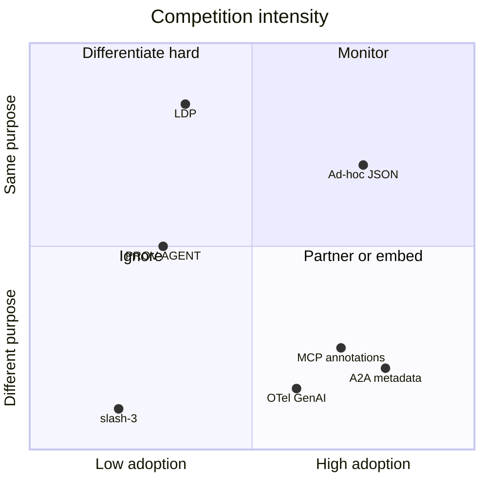

# LAR-1 — Alternatives & Competitive Landscape

How LAR-1 relates to existing approaches. **LAR-1 does not replace transports** — it standardizes semantic metadata that any protocol can carry.

---

## Summary matrix

| Alternative | Layer | Overlap with LAR-1 | Real competition |
|-------------|-------|-------------------|------------------|
| A2A `metadata` | Transport + free-form KV | LAR-1 lives *inside* metadata | **None** (carrier, not schema) |
| MCP `_meta` / annotations | Tool behavior hints | Partial (`C`, `L` on tools) | **Low** |
| **LDP** | Full delegate protocol | `L`, `E`, provenance, identity | **High** |
| OpenTelemetry GenAI | Observability / tracing | Agent id, spans | **Low** |
| W3C PROV / PROV-AGENT | Audit provenance graphs | `E`, derivation | **Medium** |
| LangGraph `additional_kwargs` | Ad-hoc per-message JSON | Any custom block | **Medium** (chaos, not standard) |
| CrewAI / AutoGen fields | Framework-specific | Same | **Low** (siloed) |
| **`/3` (Third Protocol)** | Position / intent signals | Cognitive stance | **None** (complementary) |

---

## Detailed analysis

### 1. A2A (Agent2Agent)

**What it is:** Google's protocol for agent↔agent task delegation, messages, artifacts.

**Metadata model:** `google.protobuf.Struct` on `Message.metadata` — any JSON-compatible KV. Plus `extensions[]` URIs for typed profiles.

**Relation to LAR-1:** A2A explicitly defers semantic conventions to extensions. LAR-1 is designed as one such extension (`application/lar+json` typed part + capability in agent card).

**Competition:** **None.** A2A is the highway; LAR-1 is a standardized label on the cargo.

**Strategy:** Register extension URI, contribute sample to A2A ecosystem, never fork A2A.

---

### 2. MCP (Model Context Protocol)

**What it is:** Anthropic-led protocol for tools, resources, prompts between hosts and servers.

**Metadata model:** Tool `annotations` (`readOnlyHint`, `destructiveHint`, …), `_meta` on resources, content annotations (audience, priority).

**Relation to LAR-1:** MCP annotations describe **tool behavior** (safety). LAR-1 describes **message semantics** (observation vs inference, confidence, verification). Orthogonal layers.

**Competition:** **Low.** Could overlap if MCP adds "confidence" SEPs — LAR-1 should propose mapping, not fight.

**Strategy:** `experimental-ext-lar` via `_meta`; middleware on tool results and sampling messages.

---

### 3. LDP (LLM Delegate Protocol) — primary competitor

**Repo:** [sunilp/ldp-protocol](https://github.com/sunilp/ldp-protocol)  
**Paper:** [arXiv:2603.08852](https://arxiv.org/abs/2603.08852)

**What it is:** Full AI-native protocol extending A2A/MCP with:

- Rich delegate identity (model, quality scores, cost)
- Governed sessions
- Structured provenance on every `TASK_RESULT`
- **Verification** alongside confidence

**Key research finding:** Self-reported confidence **without verification degrades** downstream synthesis below no-provenance baseline. LDP addresses this with `verified: bool` + verification status.

**Overlap with LAR-1:**

| LDP | LAR-1 |
|-----|-------|
| `confidence` | `L` |
| `provenance.produced_by` | (not in LAR-1 — by design) |
| `verified` | `V` enum |
| Full delegate graph | 5–6 fields only |

**Competition:** **High** for the "agent message semantics" niche.

**LAR-1 differentiation:**

| LAR-1 advantage | LDP advantage |
|----------------|---------------|
| Minimal (5–6 fields) | Complete delegate lifecycle |
| Protocol-agnostic overlay | Purpose-built protocol |
| Human-readable compact `LAR:` format | RFC + research backing |
| Works inline in prompts | Session governance, payload modes |

**Strategy:** Position LAR-1 as **LDP-compatible shorthand** — publish mapping table (`L` ↔ `confidence`, `V` ↔ `verified`). Target developers who won't adopt a full new protocol but will add a header.

---

### 4. OpenTelemetry GenAI semantic conventions

**What it is:** Emerging OTel spans for `invoke_agent`, `execute_tool`, MCP operations — observability layer.

**Relation to LAR-1:** OTel records what happened **after the fact** in traces. LAR-1 tags what a message **means** inline for routing/decisions.

**Competition:** **Low** — complementary. Export path: LAR-1 fields → span attributes (`lar1.cognition`, `lar1.likelihood`).

**Strategy:** Document OTel attribute mapping; partner with observability vendors (Langfuse, Phoenix, Datadog).

---

### 5. W3C PROV / PROV-AGENT

**What it is:** Standard provenance ontology (Entity, Activity, Agent) extended for agentic workflows and MCP integration.

**Relation to LAR-1:** PROV models full derivation graphs. LAR-1 is a **flat summary** suitable per-message, not per-workflow.

**Competition:** **Medium** for compliance/audit use cases — PROV wins for deep lineage; LAR-1 wins for lightweight inline tags.

**Strategy:** Optional PROV export adapter: `E=derived` → `prov:wasDerivedFrom` link generation.

---

### 6. Framework ad-hoc metadata

**LangGraph:** `additional_kwargs` on messages — de facto metadata bag.  
**CrewAI / AutoGen:** Custom message fields per framework.

**Competition:** **Medium** against **inaction** — most teams use unstructured JSON. LAR-1 competes with **convention vacuum**, not LangChain itself.

**Strategy:** `lar1-langgraph` package + demo; document convention in LangChain community forum.

---

### 7. `/3` (Third Protocol) — sister, not competitor

**Repo:** [carlsonchik/third](https://github.com/carlsonchik/third)

**What it is:** Minimal signal language for *position* — code, state, intent (`.INI.S.Q.Hello`).

| Layer | Protocol | Question answered |
|-------|----------|-------------------|
| Signal | `/3` | *From what position am I speaking?* |
| Semantic | LAR-1 | *What kind of claim is this, how confident, how verified?* |
| Transport | A2A / MCP | *How do bits move?* |

**Competition:** **None.**

**Strategy:** Document unified stack; cross-link READMEs; joint demo.

---

## Who we actually compete with

1. **LDP** — only serious direct rival for provenance/confidence semantics.
2. **Ad-hoc `metadata`** — default "competitor"; win with conformance + 5-line integration.
3. **Everyone else** — partners or downstream consumers.

---

## Positioning statement

> **LAR-1 is the MIME type for agent message meaning** — too small to replace A2A, MCP, or LDP; too useful to leave as random JSON keys.

---

## Risks

| Risk | Mitigation |
|------|------------|
| "Another metadata format" | Conformance suite + official A2A/MCP profiles |
| LDP gains traction first | Compatibility mapping; "lightweight mode" |
| Low adoption | Dogfood in `/3` stack, Cursor hooks, LangGraph demo |
| `L` without `V` misleads users | Default `V=unverified`; document LDP research |

---

## References

- [A2A Protocol](https://a2a-protocol.org/)
- [MCP Specification](https://modelcontextprotocol.io/specification)
- [LDP Protocol](https://github.com/sunilp/ldp-protocol)
- [OpenTelemetry GenAI Conventions](https://opentelemetry.io/docs/specs/semconv/gen-ai/)
- [PROV-AGENT paper](https://arxiv.org/html/2508.02866)
- [/3 Third Protocol](https://github.com/carlsonchik/third)
