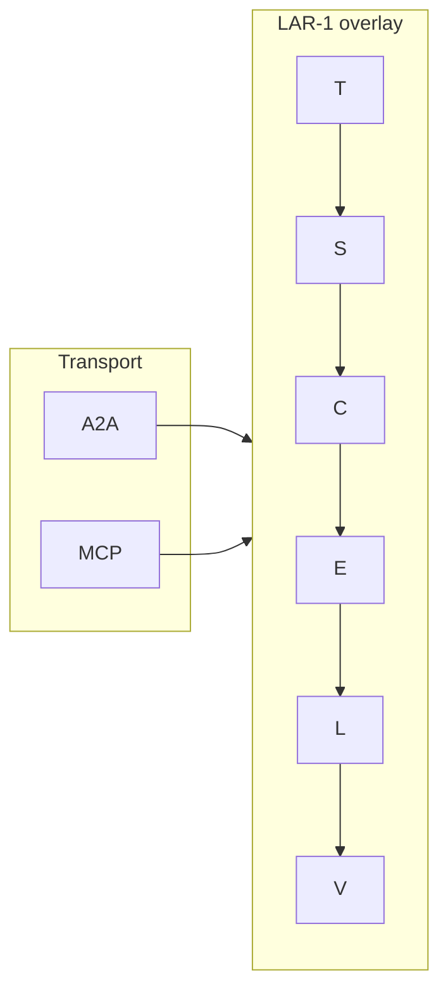

# LAR-1 Development Roadmap

> **Latent Agent Register** — semantic overlay for agent communication  
> Status: v0.2 (schema + reference SDK skeleton)

## Vision

LAR-1 is **not** a transport or orchestration protocol. It is a compact, machine-readable semantic layer that answers: *how is this message situated?* — before routing, synthesis, or audit.



---

## Phase 0 — Stabilize specification (v0.2) ✅ complete

**Goal:** Turn the discussion draft into a normative, testable spec.

| Deliverable | Status |
|-------------|--------|
| JSON Schema (`SPEC/lar1-schema.json`) | ✅ |
| Compact format grammar | ✅ |
| Conformance fixtures (`SPEC/conformance/`) | ✅ |
| Field `V` (verification) | ✅ |
| Extension URI (GitHub raw JSON) | ✅ |
| Extension descriptor (`SPEC/extension-v0.2.json`) | ✅ |
| Update root `SPEC.md` to v0.2 enums | ✅ |
| Update `README.md` to v0.2 | ✅ |
| Governance / versioning doc (`GOVERNANCE.md`) | ✅ |
| CI (conformance + demo smoke) | ✅ |

**Exit criteria:** Two independent implementations parse the same compact string to identical JSON.  
✅ TypeScript (`@lar-1/core`) and Python (`lar1semantic`) both pass conformance fixtures.

---

## Phase 1 — Reference SDK (v0.3) ✅ complete (publish pending)

**Goal:** Minimal library — not a framework.

```
packages/
  lar1-core/     ✅ TypeScript — parse, validate, serialize, compact
  lar1-python/   ✅ Python mirror + CLI
  lar1-cli/      ✅ Node CLI (validate, compact, json)
```

| Deliverable | Status |
|-------------|--------|
| `@lar-1/core` TypeScript package | ✅ |
| `lar-1` Python package | ✅ |
| Conformance test runner (TS + Python) | ✅ |
| CLI: `lar1 validate`, `lar1 compact`, `lar1 json` | ✅ |
| Publish to npm | 🔲 see [PUBLISHING.md](PUBLISHING.md) |
| Python package on PyPI | 🔲 see [PUBLISHING.md](PUBLISHING.md) |

**Exit criteria:** `npm install @lar-1/core` → annotate a message in ≤10 lines.

---

## Phase 2 — Integration profiles (v0.4) ✅ complete

**Goal:** Show exactly how LAR-1 attaches to real protocols.

### A2A

- Typed `Part` with `Content-Type: application/lar+json`
- Agent card capability block
- Extension registration in [a2aproject/A2A](https://github.com/a2aproject/A2A) discussions

### MCP

- `_meta` profile on tools, resources, prompts, tool results
- Reference middleware for MCP servers

### LangGraph / LangChain

- `additional_kwargs["lar-1"]` convention
- Middleware auto-tagging `C` and `E` by node type

| Deliverable | Status |
|-------------|--------|
| `lar1-a2a` adapter package | ✅ |
| `lar1-mcp` adapter package | ✅ |
| LangGraph middleware (`lar1.langgraph`) | ✅ |
| LangGraph demo | ✅ (`demos/langgraph-synthesis/`) |
| MCP reference server | ✅ (`demos/mcp-lar1/`) |
| A2A wire demo | ✅ (`demos/a2a-lar1/`) |
| Cursor hooks example | ✅ (`examples/cursor-hooks/`) |
| A2A WG discussion update | ✅ [#1974](https://github.com/a2aproject/A2A/issues/1974#issuecomment-4831099763) |

**Exit criteria:** Working demo in at least two ecosystems (LangGraph + MCP or A2A).

---

## Phase 3 — Prove value

**Goal:** Demonstrate that LAR-1 changes outcomes — not just metadata.

| Scenario | What it proves |
|----------|----------------|
| **Multi-agent synthesis** | Synthesizer weights by `L`, `C`, `V` → fewer bad merges |
| **Audit trail** | Filter `E=direct` before destructive tool calls |
| **Memory routing** | `T=recall` vs `T=now` → correct RAG context |

| Deliverable | Status |
|-------------|--------|
| LangGraph synthesis demo | ✅ skeleton |
| Noisy-`L` experiment (verification matters) | ✅ [`demos/noisy-l-experiment/`](demos/noisy-l-experiment/) |
| Blog post + reproducible repo | 🔲 deferred |

**Exit criteria:** Published comparison showing measurable difference with vs without LAR-1.

---

## Phase 4 — Ecosystem & governance

**Goal:** Community adoption and stable evolution.

- RFC process (GitHub Discussions → SPEC PR)
- Conformance badge: "LAR-1 compatible v0.x"
- Stack documentation with sister protocol [`/3`](https://github.com/carlsonchik/third) (position/signal layer)
- awesome-mcp / awesome-a2a list PRs
- MCP Registry entry for reference server
- Optional: short arXiv note if experiments exist

---

## 30-day priorities

1. ✅ JSON Schema + conformance fixtures
2. ✅ `@lar-1/core` skeleton + tests
3. ✅ LangGraph demo skeleton
4. ✅ Update `SPEC.md` + `README.md` to v0.2
5. 🔲 Python `lar1-core` package
6. 🔲 npm publish `@lar-1/core@0.2.0`

---

## Version history

| Version | Target | Focus |
|---------|--------|-------|
| 0.1 | 2026-06 | Initial discussion draft |
| 0.2 | 2026-06 | JSON Schema, V field, conformance |
| 0.3 | TBD | SDK stable, npm/PyPI |
| 0.4 | TBD | A2A/MCP/LangGraph profiles |

---

## Related

- [ALTERNATIVES.md](./ALTERNATIVES.md) — competitive landscape
- [SPEC/lar1-schema.json](./SPEC/lar1-schema.json) — normative schema
- Sister protocol: [/3 — Third Protocol](https://github.com/carlsonchik/third)
